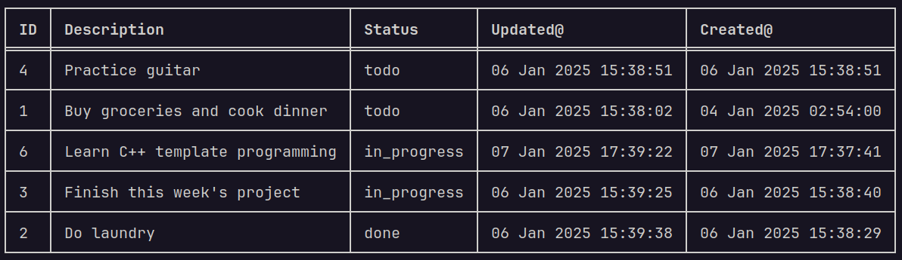

# Task tracker
Task-tracker is an offline CLI app to track your tasks and manage your to-do list.
This project has **zero** dependencies.



## Features available
- [x] Add, update, and delete tasks
- [x] Mark a task as in progress or done
- [x] List all tasks
- [x] List all tasks that are done
- [x] List all tasks that are not done
- [x] List all tasks that are in progress
- [x] Ability to install using pip
- [x] Tasks display inside pretty tables

## Development/Code structure
- pyproject.toml : This is needed to build the app into a python package which anyone can install using pip.
- src : Top level directory where the app's package lives.
  - tasktracker : This is where all the non-test source code lives.
    - tasktracker.py : This is the main entry point of the app.
    - cmdline.py : This module deals with parsing command line parameters passed to the app and produces various "Actions".
    - actions.py : Here there are classes for each action namely: ActionAdd, ActionUpdate, ActionList, ActionDelete and ActionMark.
    - status.py : This module defines the different statuses/states of each task namely `todo`, `in_progress`, `done`.
    - formatting.py : Utility functions related to string formatting goes here.
    - tasks.py : Contains classes for task management ie. the execution of different actions and for tasks persistence.
    - tables.py : This module renders pretty tables for listing tasks data.
- tests : Unit tests for actions and task management/storage lives here.

## How to install?
Task-tracker can be installed using pip like:
```
pip install git+https://github.com/dennisfrancis/task-tracker.git
```
**Note**: Sample usages below assume that you have installed the package using pip as shown above.

## Sample usages
1. Adding a new task
```
task-tracker add "Buy groceries"
task-tracker add "Do laundry"
task-tracker add "Finish this week's project"
task-tracker add "Practice guitar"
```

3. Updating and deleting tasks
```
task-tracker update 1 "Buy groceries and cook dinner"
task-tracker delete 1
```

3. Mark a task as in-progress or done
```
task-tracker mark 3 in_progress
task-tracker mark 2 done
```

4. Listing all tasks
```
task-tracker list
```

5. Listing tasks by status
```
task-tracker list done
task-tracker list in_progress
task-tracker list todo
```

## How to run without installing?
First, clone the repo:
```
git clone https://github.com/dennisfrancis/task-tracker.git
```

Go into the src subfolder inside the project root:
```
cd task-tracker/src/
```

Run tasktracker's main entrypoint function with sub-commands like:
```
python3 -m tasktracker.tasktracker list # to list tasks.
python3 -m tasktracker.tasktracker add "Learn Typescript" # add new task.
```

## Issues and Pull requests
Please report issues [here](https://github.com/dennisfrancis/task-tracker/issues). As always pull requests are welcome!

This project was made based on the specs provided in [roadmap.sh](https://roadmap.sh/projects/task-tracker).
